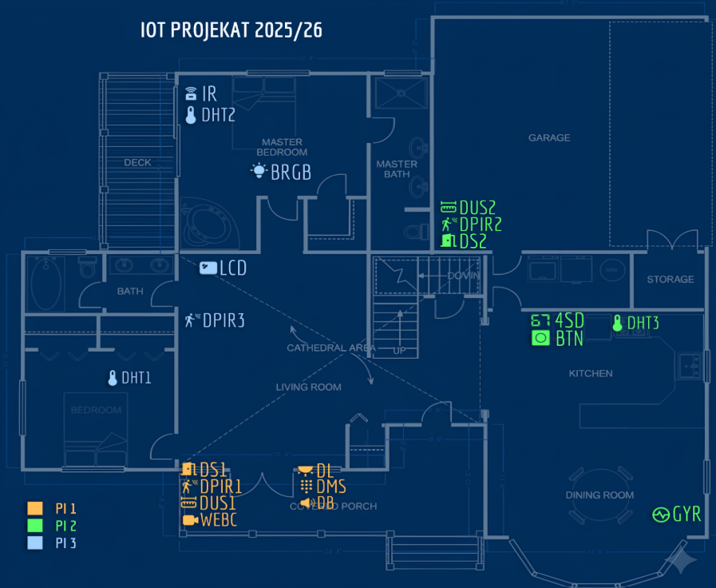

# Smart Home IoT System  
**Project for Web of Things – 2025/2026 - Faculty of Technical Sciences**

This project implements a distributed Smart Home system composed of three Raspberry Pi devices, multiple sensors and actuators, MQTT-based communication, time-series storage in InfluxDB, visualization via Grafana, and a full Web application for monitoring and control.
<p align="center">
  
</p>

---

# System Architecture

The system consists of:

- 3 × Raspberry Pi devices (PI1, PI2, PI3)
- MQTT broker
- Backend server (MQTT consumer → InfluxDB writer)
- InfluxDB (time-series database)
- Grafana (visualization dashboards)
- Web application (real-time state + control panel)

## Core Technologies

- MQTT protocol
- InfluxDB (time-series database)
- Grafana (analytics & dashboards)
- Raspberry Pi OS
- Python scripts (on PI devices)
- Backend server (Spring Boot)
- Web application (Angular)

---

# Devices and Components

## PI1 – Entrance Control

| Code | Component |
|------|-----------|
| DS1 | Door Sensor (Button) |
| DL | Door Light (LED) |
| DUS1 | Door Ultrasonic Sensor |
| DB | Door Buzzer |
| DPIR1 | Door Motion Sensor |
| DMS | Door Membrane Switch |
| WEBC | Door Web Camera |

---

## PI2 – Kitchen

| Code | Component |
|------|-----------|
| DS2 | Door Sensor |
| DUS2 | Door Ultrasonic Sensor |
| DPIR2 | Door Motion Sensor |
| 4SD | 4 Digit 7 Segment Display (Timer) |
| BTN | Kitchen Button |
| DHT3 | Kitchen DHT Sensor |
| GSG | Gyroscope |

---

## PI3 – Rooms

| Code | Component |
|------|-----------|
| DHT1 | Bedroom DHT |
| DHT2 | Master Bedroom DHT |
| IR | Infrared Receiver |
| BRGB | RGB Light |
| LCD | Living Room Display |
| DPIR3 | Living Room Motion Sensor |

---

# Alarm Logic

### ALARM State
- Activates Door Buzzer (DB)
- Events stored in the database
- Displayed in Grafana
- User notified in the Web application

### Alarm Triggers

- DS1 or DS2 active for more than 5 seconds (door unlocked simulation)
- Motion detected while no persons inside
- Incorrect PIN entry
- Significant gyroscope movement
- Motion while the system is armed without the correct PIN

### Alarm Deactivation

- PIN entry via DMS
- PIN entry via Web application

---

# People Counting Logic

- Uses DPIR + DUS combination
- Detects entry/exit direction
- Maintains a live people counter
- Stored in the database
- Displayed in a web application

---

# Environmental Monitoring

- Temperature and humidity from DHT1–3
- Displayed on LCD (rotating values)
- Visualized in Grafana
- Available in a web application

---

# Kitchen Timer

- Configurable via a web application
- Displayed on 4SD
- Button adds configurable N seconds
- Blinks at 00:00 when expired
- Stops blinking on button press

---

# RGB & IR Control

- RGB control via:
  - IR remote
  - Web application
- Full ON/OFF and color management

---

# Web Camera

- Live video feed displayed in the Web application

---

# Web Application Features

- Real-time device state display
- Alarm activation/deactivation
- PIN entry
- Kitchen timer configuration
- RGB light control
- Embedded Grafana panels
- Live camera stream
- Current system status dashboard

---

# System Design Considerations

- Deadlock-free multithreading
- Minimal critical sections
- Batch MQTT publishing
- Configurable simulation mode
- Modular architecture

---

# Running the System

## Start infrastructure - Docker

```bash
cd smartHomePython
docker-compose up -d
```

## Run backend server

- Connect to the MQTT broker
- Store incoming messages into InfluxDB

## Run Raspberry Pi scripts

Run with sensors:

```bash
cd smartHomePython
python main.py --pi PI1 --sensors
python main.py --pi PI2 --sensors
python main.py --pi PI2 --sensors
```

## Start Web Application
```bash
cd smartHomeWeb
npm install
ng serve
```

# Authors
 - Miona Lukić SV17/2022
 - Nađa Zorić SV35/2022
